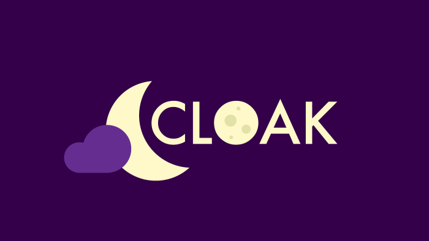

    
    <h3 align=center>An application platform that removes bias from the equation</h3>

    
    
    
    
    
     
    <a href="#about">About</a> | <a href="#features">Features</a> | <a href="#usage">Usage</a>

# About
Cloak is a form and application creation service that attempts to decrease the amount of bias that goes into applications. Often, people's subconcious biases will play a role in how well an applicant does and Cloak tries to eliminate this. It does so by hiding specified fields completely, until an application is accepted - at which point an email will be sent to the applicant. This ensures that form creators can still access data that they will need after accpetance, but makes sure that this isn't part of what determines whether someone makes it in or not.

The core functionality of Cloak resides in the Django open source Python web framework. It allows us to create flexible models, stored in a PostgreSQL database, without writing a single line of SQL. Through Django's admin pages, Cloak hides all personally identifiable information to remove potential bias from applications. Cloak is hosted on a dedicated server running an Nginx reverse proxy. Our fabulous domain name is provided by Namecheap with DigitalOcean acting as a nameserver and host. All traffic is secured through LetsEncrypt SSL certificates ensuring that your private data is safe.

*This project was made for MasseyHacks VI 2020 by [TheAvidDev](https://github.com/TheAvidDev/), [dulldesk](https://github.com/dulldesk/), and [skyflaren](https://github.com/skyflaren/).*

# Features
 - Automatic, NLP-based text summarization powered by [TextRank](https://github.com/summanlp/textrank).
 - Form access management with separate editor and reviwer roles.
 - Public application / form showcase to market your form.
 - JSON API to get your data anywhere you need it.
 - Automatic form closing, submission time tracking, and much more...

# Usage
To use Cloak, first sign up on our [site](https://cloak.theavid.dev). Then, go ahead and create a form. Feel free to add as many questions as you like of various types. Also remember that long answer questions will be automatically summarized to 100 words, with an option to view the full response on the individual response page. You can set the following parameters on the main form:
 - **Name** - A name for your form.
 - **Description** - A description about what your form is about.
 - **Open** - Whether your form is accepting submissions or not.
 - **Auto-Close Date** - A date and time to automatically close your form.
 - **Publicly Displayed** - Whether this form will be on our public display of forms or not.
 
Each form field or question also has the following parameters:
 - **Input Type** - The type of input, whether it's numeric, multiple coice, or long or short answer.
 - **Question** - A prompt or question for the user to know what to respond to.
 - **Required** - Whether this field is required or not.
 - **Secret** - Whether the response to this field will be kept completely hidden until this form is accepted. The recipient will also know whether a field is secret or not.
 - **Description** - A description or "extra information" section displayed below the question. Useful if you want answers in a particular format or want to clarify the question.
 - **Multiple Choice Choices** - One choice per line for each of the multiple choice options. Only applicable to Multiple Choice input types.

Finally, once you are done customizing your form, hit **Save and continue editing**. Then, click **View on Site** to view the form and get the link to send out to applications. And that's it! You've created a form with Cloak and can have the peace of mind that at least some bias is removed from your application process.
